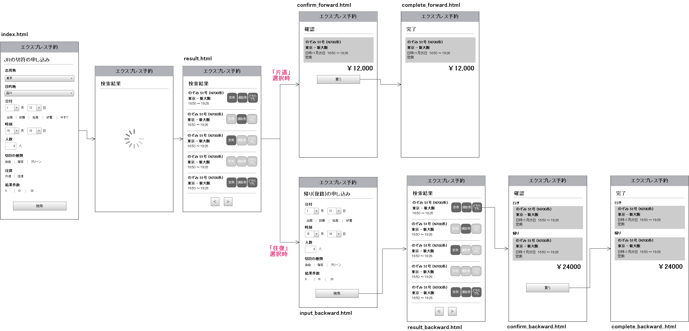

パイロット版プロトタイプ
=============

[http://designian.github.io/event20140131/](http://designian.github.io/event20140131/)

## ページ構成

* index.html
  * 検索フォーム（行き）
* result_forward.html
  * 検索結果（行き）
* confirm_forward.html
  * 確認（行き）
* complete.html
  * 完了（行き）
* search_backward.html
  * 検索フォーム（往路）
* result_backward.html
  * 検索結果（往路）
* confirm_backward.html
  * 確認（往復）
* complete_backward.html
  * 完了（往復）

## フォルダ構成

```
.
├── index.html
├── *.html
│
├── /css /* スタイルフォルダ */
│   ├── *.css
│   ├── *.less
│   └── *.scss
│
├── /img /* 画像フォルダ */
│   └── *.png, *.jpg, *.gif
│
└── /js /* JSフォルダ */
    ├── *.js
    ├── /tmpl /* テンプレートフォルダ */
    │    └── *.js
    └── /lib /* ライブラリ系JSフォルダ */
    　    └── *.js
```

## 使用ライブラリ

* [jQuery](http://jquery.com/)
  * [ドキュメント](http://api.jquery.com/)
* [Underscore.js](http://underscorejs.org/)
  * [ドキュメント](http://underscorejs.org/)
* [moment.js](http://momentjs.com/)
  * [ドキュメント](http://momentjs.com/docs/)

## ワイヤーフレーム


